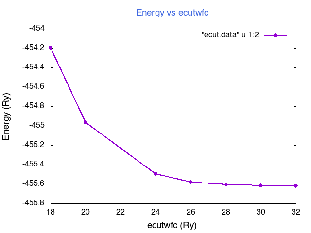

# Introduction to Quantum_ESPRESSO
Simple tools for the run, analyze and post-process quantum-ESPRESSO calculations

- Basic Linux Commands
- Basic python commands
- [Atomistic simulation environment (ASE)](https://wiki.fysik.dtu.dk/ase/index.html)

## Basic Linux Commands


<p align="center">

</p>

|Command            |  Desription                        |
|-------------------|-----------------------------------------------------------------------------------------------------|
| *ls*              | directory listing                                                                                   |
| *ls -al*          | formatted listing with hidden files                                                                 |
| *cd dir*          | change directory to dir                                                                             |
| *cd*              | change to home                                                                                      |
| *pwd*             | show current directory                                                                              |
| *mkdir dir*       | create a directory dir                                                                              |
| *rm file*         | delete file                                                                                         |
| *rm -r dir*       | delete directory dir                                                                                |
| *rm -f file*      | force remove file                                                                                   |
| *rm -rf dir*      | force remove directory dir *                                                                        |
| *cp file1 file2*  | copy file1 to file2                                                                                 |
| *cp -r dir1 dir2* | copy dir1 to dir2; create dir2 if it  doesn't exist                                                 |
| *mv file1 file2*  | rename or move file1 to file2 if file2 is an existing directory  |
| *ln -s file link* | create symbolic link link to file                                                                   |
| *touch file*      | create or update file                                                                               |
| *cat > file*      | places standard input into file                                                                     |
| *more file*       | output the contents of file                                                                         |
| *head file*       | output the first 10 lines of file                                                                   |
| *tail file*       | output the last 10 lines of file                                                                    |
| *tail -f file*    | output the contents of file as it                                                                   |


###  Bash scripting (`for & while`  loops)

+ Example 1. For Loop

    `for i in {1..10}; do echo i ; done`


+ Example 2. While loop
    ```Bash
    ls > list
    `while read -r fname
    echo $fname
    done < list
    ```

### Fisrt calculation

+Excercise 1. (INPUT file)
- getting exp or computed structure from online databases
- generating input files using easy tools
- visulizing  them using _xcrysden_, _VESTA_, _gdis_, or _ase-gui_ ...

#### SCF and convergency test for GaAs
In this exercise we will first perform simple scf (self-consistent field) calculations on GaAs structure

+ STEP 1. Use Xcrysden to view the structure of input file and explore different utilities

+ STEP 2. Open and read the input file [GaAs.scf.in](Files/GaAs.scf.in)    
Note that in the `&control` namelist, we have specified that we want to run an **scf** calculation.       
GaAs has the diamond structure. Note that we are using a (primitive) unit cell that corresponds to an fcc lattice, with 2 atoms in the atomic basis.      
Notice the values given for `ibrav, nat, ntyp` and ATOMIC-POSITIONS.         
In this file, the lattice constant **celldm(1)** has been set equal to 10.86626 bohr, which is the experimental value. \\
A 2×2×2 Monkhorst-Pack  <span style="color:purple"> k-point mesh </span> has been used.      
The plane-wave cut-off for wavefunctions, `ecutwfc` has been set to 30 Ry. Since we are not using an ultrasoft pseudopotential.   


+ STEP 3. Run your input using following command

*Hands on*

 
```Bash
      cd /WORKSHOP_QE/BULK/SECTION-SCF
      xcrysden --pwi GaAs.scf.in 
      pw.x < GaAs.scf.in | tee GaAs.scf.out
```
      
      
   
+ STEP 4. How to extract data from output file?
 
   For total energy:  `grep ! GaAs.scf.out`\
   For Total Force:  `grep Total force GaAs.scf.out`
   
   For **electron number** : `grep "of electrons    " GaAs.scf.out`
   
   Whts is the number of electrons? and Why?

   *read first lines of your pseudo files !!!*


+ STEP 5. Covergency test for K-points and ecutwf
In this step write a simple script file:Kloop.sh (k-mesh) and  file:ecutloop.sh (ecut) to run scf per different values of k-points and ecut        
Plot a Physical quantity vs. variables and find converhency limit for your data     
At the first step one can plot total energy vs. above variables:     




$$\delta$$

